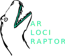

+++
title = "Home"
weight = 0
+++

The Varlociraptor Scenario Catalog

Here you can find a collection of common scenarios configuring the statistical model of [Varlociraptor](https://varlociraptor.github.io) via its variant calling grammar.

---

